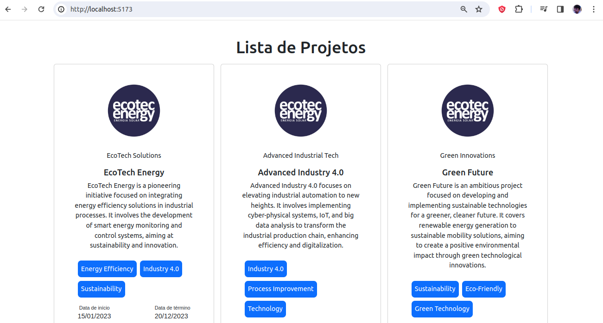
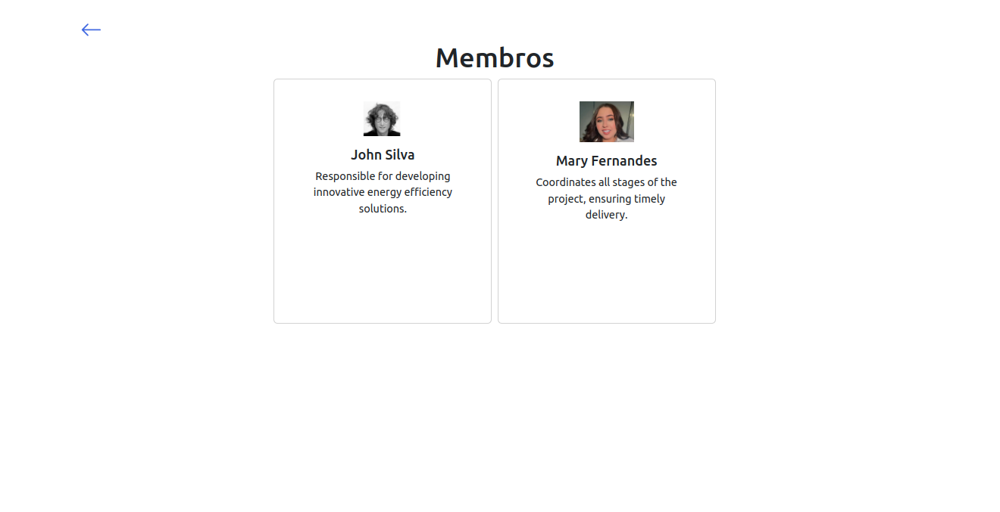
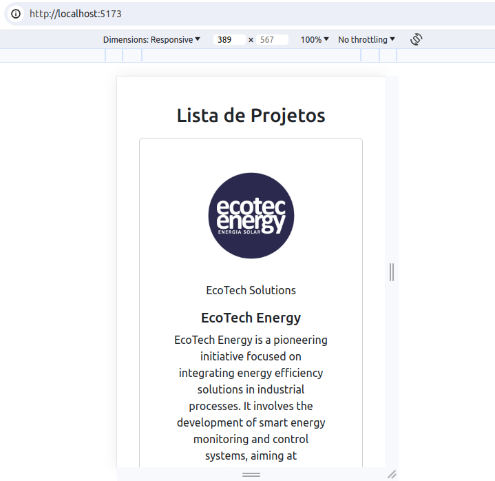
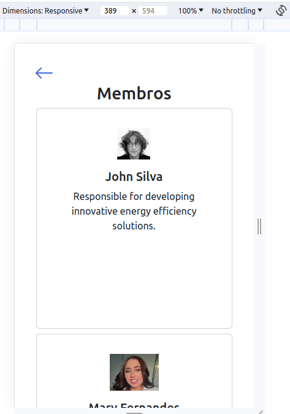

# Init Project

1 - git clone https://git.lse.dev.br/i40-expert/frontend-challenge/johnson.git

2 - Fazer autenticação com usuário e token

3 - executar o seguinte comando : " cd Hub-Frontend-Challenger "

4 - executar o seguinte comando : " npm install "

5 - executar o comando : " json-server -p 4000 data.json "

6 - executar o comando : " npm run start:dev "

7- : abrir o navegador no endereço : " http://localhost:5173/ "

## Páginas do Desafio.

Lista Principal de projetos web

Lista de Membros do Projeto

Lista de projetos Mobile

Lista de projetos Membros Mobile

